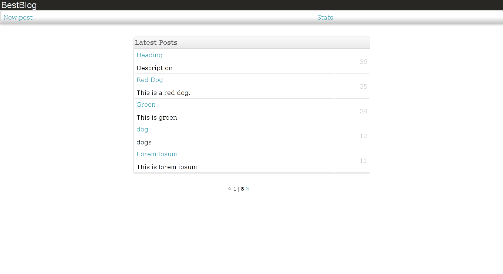
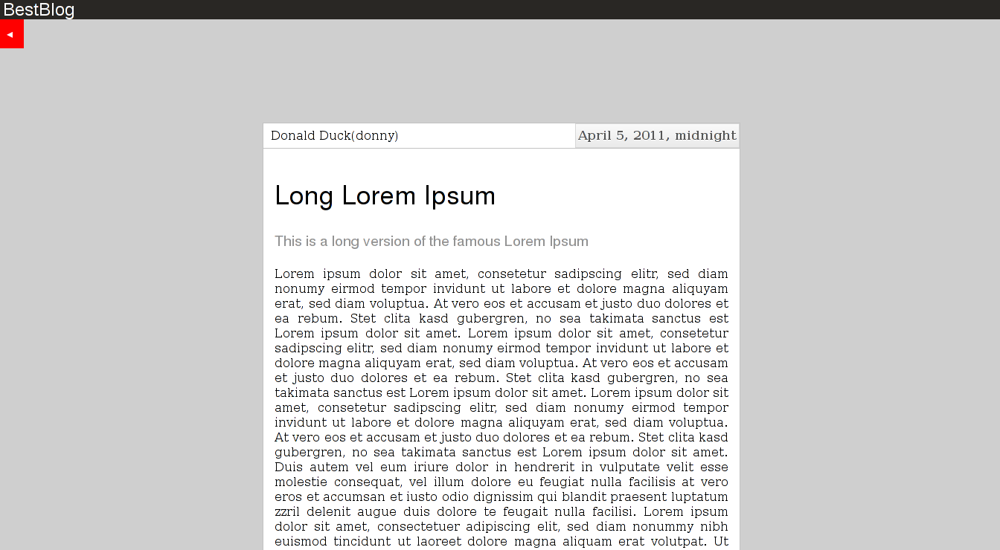
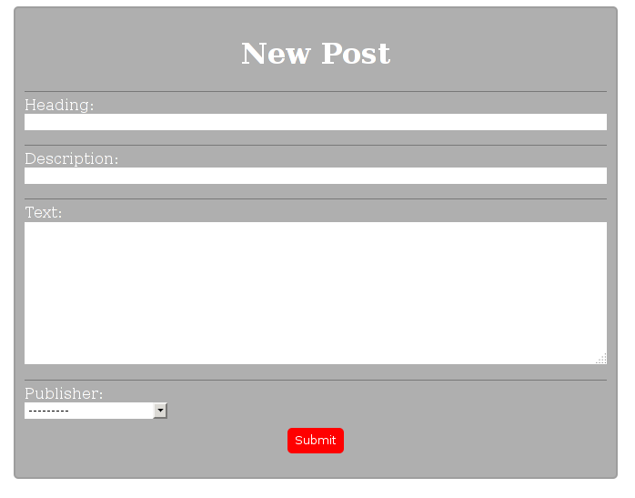
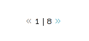

# Minimal Django Blog

This is a minimal Django example blog app.

## Features
- A list of blog posts:

- An individual page for each blog post:

- A form to create a new post:

- Minimal pagination ("next"/"previous"):

- The usual Django Admin which can be used to manage posts and authors.

## Usage

1. Run this:

    python manage.py runserver 4321

2. Direct your browser to:

    http://localhost:4321/posts
